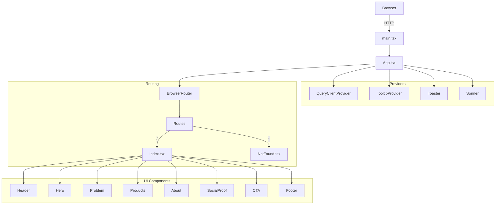

# Welcome to your Lovable project

## Project info

**URL**: https://lovable.dev/projects/7f762e4b-3075-4f71-b6b9-b9e39cbe64de

## How can I edit this code?

There are several ways of editing your application.

**Use Lovable**

Simply visit the [Lovable Project](https://lovable.dev/projects/7f762e4b-3075-4f71-b6b9-b9e39cbe64de) and start prompting.

Changes made via Lovable will be committed automatically to this repo.

**Use your preferred IDE**

If you want to work locally using your own IDE, you can clone this repo and push changes. Pushed changes will also be reflected in Lovable.

The only requirement is having Node.js & npm installed - [install with nvm](https://github.com/nvm-sh/nvm#installing-and-updating)

Follow these steps:

```sh
# Step 1: Clone the repository using the project's Git URL.
git clone <YOUR_GIT_URL>

# Step 2: Navigate to the project directory.
cd <YOUR_PROJECT_NAME>

# Step 3: Install the necessary dependencies.
npm i

# Step 4: Start the development server with auto-reloading and an instant preview.
npm run dev
```

**Edit a file directly in GitHub**

- Navigate to the desired file(s).
- Click the "Edit" button (pencil icon) at the top right of the file view.
- Make your changes and commit the changes.

**Use GitHub Codespaces**

- Navigate to the main page of your repository.
- Click on the "Code" button (green button) near the top right.
- Select the "Codespaces" tab.
- Click on "New codespace" to launch a new Codespace environment.
- Edit files directly within the Codespace and commit and push your changes once you're done.

## What technologies are used for this project?

This project is built with:

- Vite
- TypeScript
- React
- shadcn-ui
- Tailwind CSS

## How can I deploy this project?

Simply open [Lovable](https://lovable.dev/projects/7f762e4b-3075-4f71-b6b9-b9e39cbe64de) and click on Share -> Publish.

## Can I connect a custom domain to my Lovable project?

Yes, you can!

To connect a domain, navigate to Project > Settings > Domains and click Connect Domain.

Read more here: [Setting up a custom domain](https://docs.lovable.dev/tips-tricks/custom-domain#step-by-step-guide)

## Comprehensive Product & Technical Review

### 1. Product Intent & Business Goal (Senior Product Manager)
**Intent:**
Adsalt Studios' landing page is designed to attract small business owners and demonstrate how AI tools can help them save time, reduce costs, and grow their businesses. The site positions Adsalt Studios as a people-first, results-driven partner for local businesses, offering both AI-powered products and training services.

**Business Goal:**
- Generate leads via Calendly scheduling and email capture.
- Educate visitors on the value of AI for small businesses.
- Build trust through testimonials and clear value propositions.

### 2. User Experience (Senior UX Designer)
- **Clear Journey:** The page flows from problem identification ("You're drowning in busywork") to solution (AI tools), social proof, and a strong call to action.
- **Navigation:** Smooth scroll navigation and clear sectioning (Problem, Products, About, Proof, CTA).
- **Accessibility:** Good color contrast, large touch targets, and clear CTAs. Consider adding more ARIA labels and keyboard navigation checks.
- **Conversion:** Multiple CTAs (Calendly, email form) and trust signals (testimonials, company values).

### 3. User Interface (Senior UI Designer)
- **Branding:** Consistent use of brand colors (#305A72, #D9B6A3, #E9ECEF), logo, and typography.
- **Visual Hierarchy:** Large headings, clear section breaks, and visually distinct CTAs.
- **Responsiveness:** Uses Tailwind for responsive design; check all breakpoints for polish.
- **Improvements:**
  - Add subtle animations for section transitions.
  - Consider more imagery or iconography for emotional impact.
  - Ensure all images have descriptive alt text.

### 4. Architecture (Senior Architect)


**Notes:**
- Modular section components for each landing page area.
- Uses React Router for routing, TanStack Query for data (future extensibility), and shadcn-ui for UI primitives.
- Good separation of concerns; could add lazy loading for sections if performance is a concern.

### 5. Development (Senior Web Developer)
- **Strengths:**
  - Modern stack (Vite, React, TypeScript, Tailwind, shadcn-ui).
  - Clean, readable code with reusable components.
  - Good use of hooks for scroll animation and toast notifications.
- **To Do:**
  - Add form backend for email capture (currently only logs to console).
  - Add error boundaries for robustness.
  - Consider analytics integration (e.g., Google Analytics, Hotjar).
  - Add unit and integration tests (see QA section).

### 6. Quality Assurance (Senior Tester)
- **What to Test:**
  - All navigation and CTAs (Calendly, email form, section scroll).
  - Responsiveness on all devices.
  - Accessibility (keyboard navigation, screen reader labels, color contrast).
  - Form validation and error handling.
  - Fallback for broken images or network errors.
- **Improvements:**
  - Add automated tests (Jest, React Testing Library, Cypress for E2E).
  - Add Lighthouse checks for performance and accessibility.

### 7. Completion Checklist
- [x] Section structure and navigation
- [x] Product and training offering descriptions
- [x] Social proof/testimonials
- [x] Contact and CTA integration
- [x] Responsive design
- [ ] Email form backend integration
- [ ] Analytics and error boundaries
- [ ] Automated testing and accessibility audit

---
**Summary:**
The Adsalt Studios landing page is well-structured and visually appealing, with a clear value proposition for small businesses. To reach production quality, focus on backend integration for lead capture, analytics, accessibility, and automated testing.

# 🧂 Adsalt Studios – Brand Guide

Helping small businesses work faster, smarter, and cheaper with AI.  
Rooted in trust, powered by simplicity, and built for real people.

---

## 🔹 Mission  
We help small business owners work faster, smarter, and cheaper by building AI tools and systems that cut waste and help them grow.

---

## 🔹 Vision  
**Revive the village.**  
Help small businesses become the heart of their communities again, using smart tools to build a better way to live and work.

---

## 🔹 Values  
- **Keep it simple**  
- **People come first**  
- **Move with meaning**

---

## 🔊 Brand Voice

Adsalt Studios sounds like someone you trust:  
**clear, grounded, and a little bold.**

### Voice Qualities
- **Plainspoken** – Talk like a real person. No jargon.  
- **Warm and direct** – Kind, but clear. Respect people's time.  
- **Helpful, not salesy** – Teach first. Let results do the selling.  
- **Confident, not cocky** – Say what you know simply.

---

## ✍️ Style & Tone Guidelines

| Element             | Guidelines                                                                 |
|---------------------|----------------------------------------------------------------------------|
| **Reading level**    | 8th–9th grade. Easy to read and easy to trust.                           |
| **Pacing**           | Keep it tight. Cut the fluff.                                             |
| **Formatting**       | Short paragraphs, clear headings, bullet points where helpful.            |
| **Grammar**          | Conversational but clean. Use contractions.                              |
| **Tone words**       | Friendly. Smart. Calm. Straight-up.                                       |
| **Avoid tones like** | Corporate, robotic, academic, overly clever.                             |

---

## 🧠 Voice Examples

**Instead of this:**  
> We specialize in AI-driven operational optimization that enables scalable growth.

**Say this:**  
> We help you save time and grow your business using smart, simple AI.

**Instead of this:**  
> Unlock next-gen productivity with our proprietary systems.

**Say this:**  
> Get more done with tools that work the way you do.

---

## ✍️ Copywriting Guide  
**Write like a real person. Avoid the AI-sounding traps.**

### ❌ 1. Rhetorical Questions  
> "The real win?" "The truth?" "The secret to scale?"  
**Why it fails:** Sounds cheesy and artificial.  
**Do this instead:**  
✅ *"The truth is, most tools are too complicated for small businesses. We fixed that."*

---

### ❌ 2. Colon Titles  
> "The Rundown: What's Hot This Month"  
**Why it fails:** Two weak ideas instead of one strong one.  
**Do this instead:**  
✅ *"What's Hot This Month"*

---

### ❌ 3. "Not only, but also" Statements  
> "This isn't just a course. It's a transformation."  
**Why it fails:** Sounds like a bad commercial.  
**Do this instead:**  
✅ *"This course shows you how to cut admin time in half using one tool you already have."*

---

### ❌ 4. Repetitive Sentences  
> "You don't need another course. You don't need another plan. You just need clarity."  
**Why it fails:** Robotic if overused.  
**Do this instead:**  
✅ *"You've tried the courses. You've downloaded the templates. Now you're just tired. Let's fix that."*

---

### ❌ 5. "No this, no that, just the other" Copy  
> "No fluff. No mindset tips. Just results."  
**Why it fails:** Lazy. Lists what it's not.  
**Do this instead:**  
✅ *"We built a tool that cuts email busywork in half — not by magic, but with smart AI."*

---

### ❌ 6. Unnecessary Adjectives  
> "Real transformation." "Next-level strategy."  
**Why it fails:** Means nothing without specifics.  
**Do this instead:**  
✅ *"You'll spend less time managing tasks and more time actually running your business."*

---

### ✅ Adsalt Copywriting Rules

1. **Cut filler. Say the thing.**  
2. **Don't dress it up — ground it.**  
3. **Avoid formulaic hype.**  
4. **Be useful, be kind, be sharp.**  
5. **Write like you're texting a friend who owns a business down the street.**

---

## 🎨 Visual Identity

### Color Palette

| Role            | HEX        | Description                          |
|-----------------|------------|--------------------------------------|
| Primary         | `#305A72`  | Dusty steel blue — calm and trusted  |
| Secondary       | `#E9ECEF`  | Light stone gray — clean and modern  |
| Accent 1        | `#A4B9C7`  | Soft denim — friendly and fresh      |
| Accent 2        | `#D9B6A3`  | Soft clay — warm and human           |
| Support         | `#7D9BA6`  | Slate blue-gray — grounding element  |
| Tertiary        | `#D7EAFB`  | Airy sky blue — adds lightness       |
| Text            | `#1E1E1E`  | Rich charcoal — highly readable      |

---

### Typography System

| Use            | Font Recommendation        | Notes                                |
|----------------|-----------------------------|--------------------------------------|
| Headings       | `Fraunces`, `Clash Display` | Adds character, warmth, and trust    |
| Subheadings    | `Inter Medium`              | Clean, modern structure              |
| Body Text      | `Inter`, `Open Sans`        | Highly readable and neutral          |
| CTA Buttons    | `Inter Bold`                | Clear, strong, and accessible        |

---

## 📸 Imagery & Icons

### Style

- Clean, minimal, soft-edged
- Real small business moments: barbershops, cafés, home offices
- Warm lighting, human presence
- Blend analog and digital tools

### Icon Themes

- Smart tools (gear, slider, spark)
- Clarity (light bulb, magnifier)
- Community (storefronts, handshake)
- Progress (clipboard, arrow, upload)

### Resources

- [Streamline Icons](https://streamlinehq.com/)
- [Humaaans](https://www.humaaans.com/)
- [Tabler Icons](https://tablericons.com/)
- [IconScout Flat Illustrations](https://iconscout.com/illustrations/flat)

---

## 🧩 Component Tokens

| Component         | Style                                                                 |
|------------------|------------------------------------------------------------------------|
| **Primary Button** | Soft clay `#D9B6A3` background, white text, 6px radius, hover: dusty blue `#305A72` border |
| **Secondary Button** | Denim text, transparent background, hover underline              |
| **Input Fields**   | Sky blue `#D7EAFB` background, soft clay focus border                |
| **Cards**          | Light stone background, subtle shadow, icon top-left                |
| **Modals**         | White container, rounded corners, centered, soft shadow             |
| **Tooltips**       | Soft denim `#A4B9C7` background, white text, 12px rounded font       |
| **Badges**         | Slate blue `#7D9BA6` background, white text, pill shape              |
| **Navigation**     | White background, sticky, bold slate links with hover underline      |
| **Dividers**       | Muted teal or slate, 1px solid line                                  |

---

## 🧠 Design Philosophy

**Beautiful and emotional yet clean**

Every design decision should balance **emotion** and **clarity**:

- Function must serve story — even UI flows should feel meaningful.
- Microinteractions should feel alive, not static.
- Animations should be soft and intentional — fade-ins, easing, no hard bounces.
- Whitespace is a feature — use it to create calm.
- Contrast creates focus, warmth builds trust — use both wisely.
- Typography carries tone — headings should feel like a voice, not a system.
- CTAs should feel like invitations, not orders.

> Design for the local business owner who just discovered AI. Make it feel like home — not a dashboard.

---

*Last updated: June 2025*
